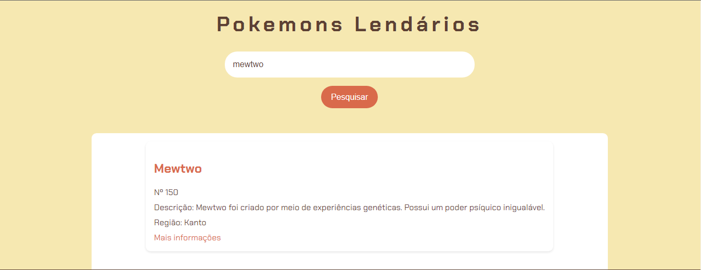

# Imersão Dev Gemini IA

## Descrição
Este repositório contém o código desenvolvido durante a Imersão Dev Gemini, uma iniciativa da Alura em parceria com o Google.Utilizando a poderosa tecnologia do [Gemini IA](https://gemini.google.com/), este projeto web oferece uma experiência de pesquisa personalizada para Pokemons lendários. Descubra informações relevantes sobre seus pokemons lendários favoritos de forma rápida e fácil.

## Índice

- [Vercel](#vercel)
- [Tecnologias Utilizadas](#tecnologias-Utilizadas)
- [Funcionalidades](#funcionalidades)
- [Como Utilizar](#como-Utilizar)
- [Comandos teclado no VS-Code](#comandos-teclado-no-vs-code)
- [Prompts usados na Aula 01](#prompts-usados-na-aula-01)
- [Prompts usados na Aula 02](#prompts-usados-na-aula-02)
- [Prompts usados na Aula 03](#prompts-usados-na-aula-03)
- [Prompts usados na Aula 04](#prompts-usados-na-aula-04)
- [Prompts usados na Aula 05](#prompts-usados-na-aula-05)
- [Extensões VS-Code](#extensões-vs-code)

## Vercel
- Fiz deploy da minha aplicação atráves da Vercel. Caso queira testar [clique aqui](https://imersao-dev-gemini-ia.vercel.app/)

## Tecnologias Utilizadas
* **HTML5:** Estrutura da página web.
* **CSS3:** Estilização da página, incluindo layout, cores e tipografia.

## Funcionalidades
* **Pesquisa de Atletas:** Permite ao usuário inserir o nome de um pokemon lendário e buscar informações relacionadas(Em desenvolvimento).
* **Interface Intuitiva:** Design limpo e organizado para facilitar a navegação.
* **Responsividade:** A página se adapta a diferentes tamanhos de tela.

## Como Utilizar
1. **Clone este repositório:**
   ```bash
   git clone https://github.com/BredexBR/Imersao-Dev-Gemini-IA.git

2. Abra o arquivo index.html em um navegador web.

<br>



<br>

## Comandos teclado no VS-Code
- CTRL + ALT + F : Se estiver dentro de um arquivo .html com o conteúdo selecionado(CTRL + A), ira identar(beautify) o codigo.

## Prompts usados na Aula 01
- Quais tecnologias preciso aprender para criar o meu site?
- Quais ferramentas posso utilizar para desenvolver o código do meu site?
- Estou criando o meu HTML, poderia me ajudar a descrever o que cada linha faz?
- Meu site é para o público brasileiro, que fala o idioma português. Como altero para esse idioma?
- Estou criando um HTML e preciso de um campo para pessoas digitarem palavras para realizar uma busca em - minha base de conhecimento. Qual tag HTML posso usar?
- Estou criando um projeto com HTML e CSS, e gostaria de alinhar todos os meus textos ao centro da tela. - Qual propriedade que posso usar para isso?
```CSS
[Inserir código]
```
- Tenho um CSS com essas propriedades, pode me explicar o que cada uma delas faz?

## Prompts usados na Aula 02
- Faça um curto parágrafo sobre a atleta Rebeca Andrade
- Nesse trecho HTML, o que significa o target="_blank"
- Tenho o seguinte código HTML
```HTML
[Adicionar código]
```
Agora, gostaria de criar mais 2 atletas: a Rayssa Leal do skate e a Beatriz Souza do Judô.
- Estou estudando programação e gostaria de criar um hello world usando - JavaScript. Pode me ajudar?
- Por que devo colocar a tag script:src antes do fechamento do body em um arquivo HTML?
- Tenho o seguinte código JavaScript
```JS
[Adicionar código]
```
Ao executar tenho a seguinte mensagem de erro:
(Adicionar print de tela ou copiar mensagem).
O que estou fazendo de errado?


## Prompts usados na Aula 03
- Estou estudando JavaScript e gostaria de entender os tipos de variáveis que existem. Me mostre alguns exemplos sobre os tipos mais comuns
Tenho o seguinte código JavaScript
```JS
[Adicionar código]
```
- Gostaria de criar mais 2 objetos com a mesma estrutura. Crie sobre a Beatriz Souza do Judô e a Rebeca Andrade da Ginástica
- Crie uma lista de objetos JavaScript, que contenham os campos: Título; Sinopse; Gênero Crie sobre filmes de terror dos anos 80 com 3 filmes
- Crie uma lista de objetos sobre cartas de D&D com os seguintes atributos: Nome da carta; Tipo (personagem, item, arma); Ponto de força; Descrição. Crie 3 cartas de cada tipo em uma lista de objetos JavaScript.

## Prompts usados na Aula 04
```JS
[Inserir código]
```
- Tenho essa base de código e gostaria de incluir comentários, sem modificar o código ou nomes de variáveis

##  Prompts usados na Aula 05
- O que é Camel Case em linguagem de programação?
- Tenho a seguinte aplicação
```HTML
[Inserir index.html]
```
E meu JavaScript
```JS
[Inserir app.js]
```
Agora, escreva um read.me para o GitHub de uma forma descontraída que explique como a aplicação funciona, quais tecnologias foram utilizadas.
- Reescreva em markdown


## Extensões VS-Code
- **Live Server:** Permite que você execute um servidor de desenvolvimento local diretamente do seu editor, fornecendo uma pré-visualização em tempo real de páginas web à medida que você faz alterações no código. Quando ativada, a extensão abre automaticamente seu projeto em um navegador e recarrega a página sempre que você salva um arquivo HTML, CSS ou JavaScript, facilitando o desenvolvimento de aplicações web ao proporcionar um fluxo de trabalho mais ágil e dinâmico.